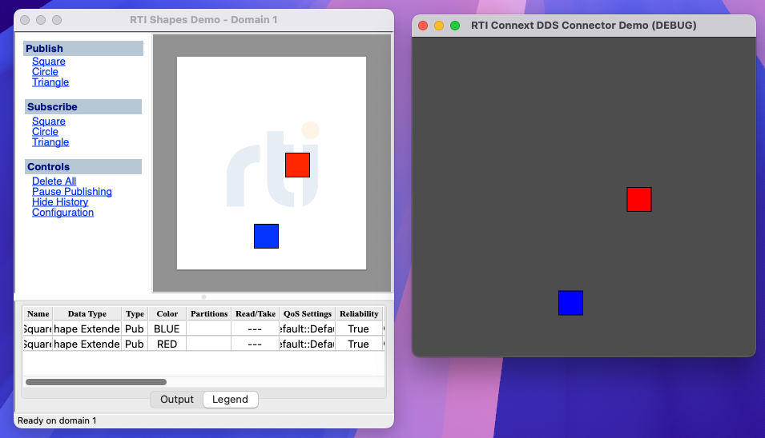

# RTI Connext DDS Connector Demo

A demo [Godot 4](https://godotengine.org/) project for [godot-rticonnextdds-connector](https://github.com/sam-omalley/godot-rticonnextdds-connector), showing live DDS data visualised in-engine.

The screenshot below shows the [RTI Shapes Demo](https://www.rti.com/developers/rti-labs/shapes-demo) publishing shapes on the left, with Godot subscribing and mirroring their positions on the right.

## Prerequisites

- [RTI Connext DDS Professional](https://www.rti.com/products/connext-dds-professional) (with `NDDSHOME` set)
- The connector built and installed — see [godot-rticonnextdds-connector](https://github.com/sam-omalley/godot-rticonnextdds-connector)
- Godot 4

## Running

1. Start the RTI Shapes Demo and publish some shapes
2. Open this project in Godot 4 and run the main scene
